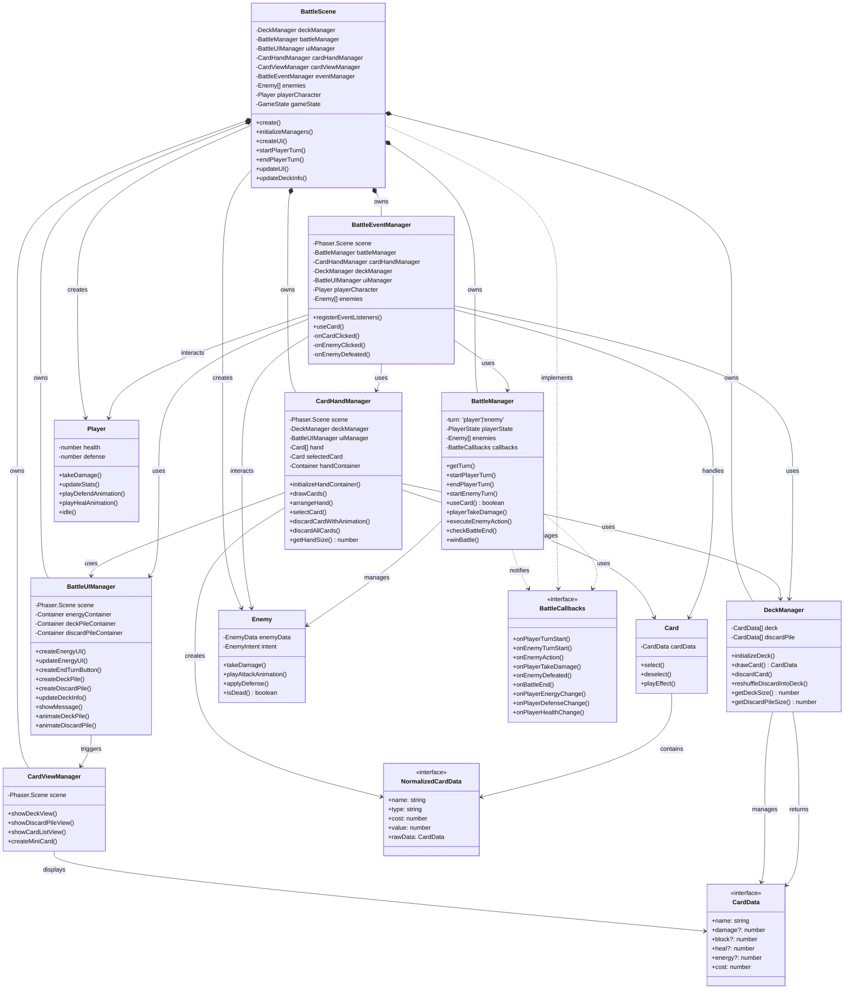
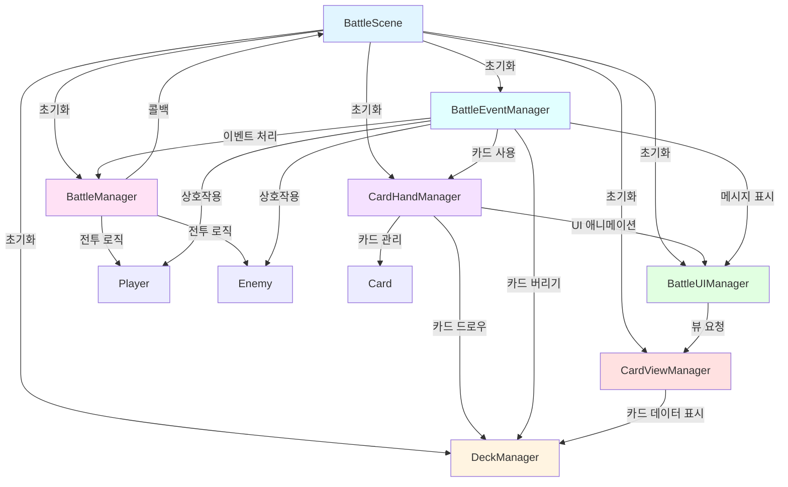
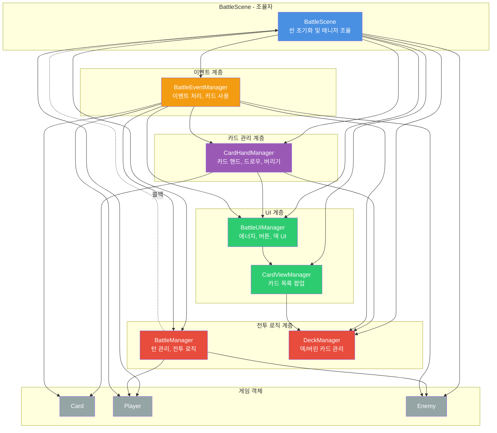
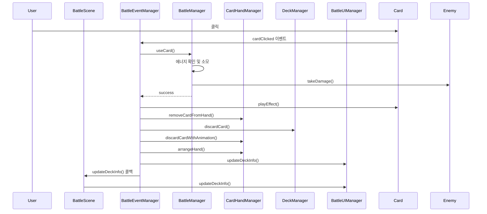

# BattleScene 아키텍처 다이어그램

## 전체 객체 관계도

## 데이터 흐름도

## 책임 분리도

## 상호작용 시퀀스 다이어그램 (카드 사용 예시)

## 주요 책임 요약

| 클래스 | 주요 책임 | 의존성 |
|--------|----------|--------|
| **BattleScene** | 씬 초기화, 매니저 조율 | 모든 매니저 |
| **BattleManager** | 전투 로직, 턴 관리 | Enemy, BattleCallbacks |
| **DeckManager** | 덱/버린 카드 데이터 관리 | CardData |
| **BattleUIManager** | UI 요소 생성 및 업데이트 | Phaser.Scene |
| **CardHandManager** | 카드 핸드 관리, 드로우/버리기 | DeckManager, BattleUIManager |
| **CardViewManager** | 카드 목록 팝업 표시 | Phaser.Scene |
| **BattleEventManager** | 이벤트 처리, 카드 사용 | 모든 매니저, 게임 객체 |

